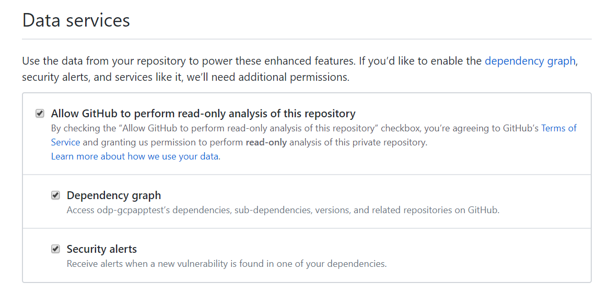
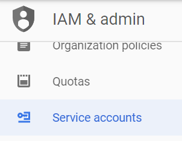
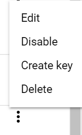
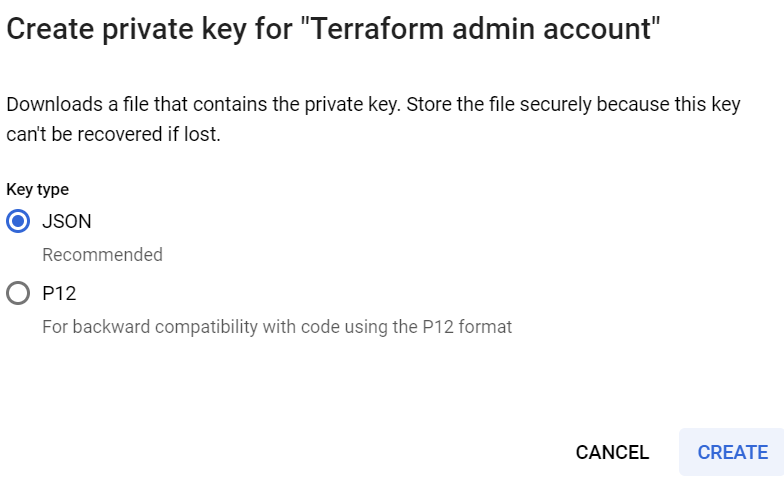
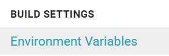
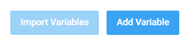
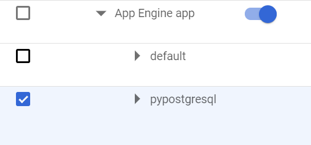
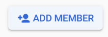
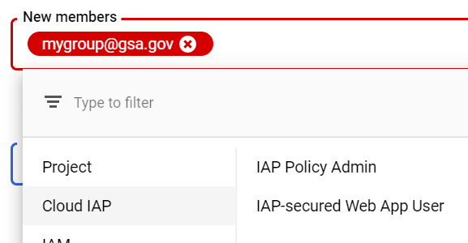

# Getting Started Guide

## Overview 

This guide will provide you with the steps required to get your project up and running.

The workflow required to accomplish this is outlined below:

* [Key Concepts](#s1)
* [GCP Project Setup](#s2)
* [Github](#s3)
* [Terraform - Infrastructure as Code](#s3.1)
* [CircleCI  Setup / Deployment](#s3.2)
* [Post Deployment Configuration](#s4)   

## Key Concepts 

### Branching and GCP Project

A core concept of deploying an AppEngine application using this template is that for each environment or branch that you wish to deploy, you will need a separate GCP Project.

* GCP Appengine projects will be provisioned, built, deployed, tested and promoted using CirclCi.
* Within CircleCI, GCP Projects are linked to repository branches by assigning branch specific environment variables that contain the Project ID
   * Example for dev branch: `GOOGLE_PROJECT_ID_dev=<MY_DEV_GCP_PROJECT>`
   * Example for master branch: `GOOGLE_PROJECT_ID_master=<MY_DEV_GCP_PROJECT>`
      * Note: The `_master` in `GOOGLE_PROJECT_ID_master` is used to identify which branch you are configuring.
* Linking GCP Project ID to a specific branch enables you to safely deploy your application by following your team's push and PR processes.

## GCP Project Setup 

Initial GCP project setup requires interfacing with the GSA ICE team as they will need to complete the initial project and user setup.

[GSA ICE group](https://www.gsa.gov/about-us/organization/office-of-the-chief-information-officer/office-of-corporate-it-services)

### Service Now Tickets

The application team will be responsible submitting a service now ticket for the following configurations:

* Pilot project request
   * Request a pilot project when you are first setting up your project in GCP and need to work through permissions and API requirements.
   * Specific team members will receive project ownership privileges. 
   * This service request will generate ticket that is sent to the ICE / GCAP team.
   * Three separate GCP Projects will be created with the same groups and permissions applied.
* Dev, Test, Prod projects request
   * Request these projects to be setup when you are ready to deploy your application in production.
   * This service request will generate ticket that is sent to the ICE / GCAP team. 
   * Three separate GCP Projects will be created with the same groups and permissions applied.
   * Your team will not receive project ownership privileges.
   * Specific team members will receive the priveleges required to deploy this template application into App Engine.
   * Additional privilege changes must be provided in separate service requests.

 

## Github 

This section will walk you through the process of setting up your own fork of this project with the required 

### Fork this project

Creating a fork of this project is required to enable your team to customize and deploy the template application within your GCP project.

* How to fork a Github project: [HowTo]( https://help.github.com/en/articles/fork-a-repo )

###  GitHub Dependency Scanning

GitHub provides it's users with built in dependency scanning.
 
To enable dependecy scanning click your GitHub repo's gear icon to enter settings and enable these three options:

   

            
## Terraform - Infrastructure as Code 

We use Terraform to provision the GCP resources required to .  Terraform init, plan, and apply are all triggered from the CircleCI portion of this project.

### Configure your project 

For details on customizing and configuring your Terraform project see the below README file: 

[Terraform README.md]( terraform/README.md)

## CircleCI  Setup / Deployment 

In this section we describe the process required to configure CircleCI.

### CircleCI Geting Started

#### Login to Circle CI

* You will want to login to [CircleCI](https://circleci.com/dashboard) using a GitHub account that has access to the repo you forked in the section [Github](#s3).
  * This will enable you to add the GitHub repo you added in the steps outlined in the section [Github](#s3).

#### Add GitHub project to CircleCI
 
   Once you are logged into CircleCI with your Github account you should see all of 

### Setup Environment Variables and Secrets

For environment variables and secrets we store them all as CircleCI environment variables.
The next few sections will describe the data and variables require to successfully configure this project.
 
#### Required data for variables

1. For each GCP project, create and download the `terraform@<PROJECT_ID>` service account's access key.
   * From GCP Console select IAM & Admin service.
   * Select Service Accounts

      

   * Select the `terraform@<PROJECT_ID>` service account, click the three dots besides the account name and finally `Create key`.

      

   * Accept the defaults creating an Access key file in JSON format.

      

   * Download and open the JSON file as you will the contents to populate the `GCLOUD_SERVICE_KEY_<BRANCH>` described in the next section with the complete contents of this file.

#### Variable List

Below is the list of variables required to successfully deploy your project.

* Note: For variables with `<BRANCH>` suffix replace this with the GitHub repo branch you wish to tie to your GCP Project ID.  
* Note: For variables with `<BRANCH>` suffix, you will need to configure these variables for each branch. 
* Note: All variables are of the type `string`.

| Variable    |  Description    | 
|---        |---              | 
| `GOOGLE_PROJECT_ID_<BRANCH>` | Project you will be deploying your app into when pushing changes to your branch set in the suffix `<BRANCH>` | 
| `GCLOUD_SERVICE_KEY_<BRANCH>`  |  Complete contents of the access key for your deployment's `terraform@<PROJECT_ID>` service account for the Project ID you set in the `GOOGLE_PROJECT_ID_<BRANCH>` variable   | 
| `NOTIFICATION_EMAIL` | Email that you wish to receive monitoring alerts | 
| `CLOUDSQL_DB` | Postgres Database Instance Name  | 
| `CLOUDSQL_USERNAME` | Username for basic CloudSQL authentication | 
| `CLOUDSQL_PASSWORD` | Password for basic CloudSQL authentication |  

#### How to configure CircleCI Environment variables

* To configure environment variables you must first access your project's then select Environement Variables under Build Settings.
 
   

* You will then need to click the Add Variable button to add the environment variables you require for your project.

   

### Deploy from Circle

Now that you have your project configured in CircleCi all that you need to do is commit any change and push your changes to either a master, dev, or test branch.

## Post Deployment Configuration 

### Google Cloud Security Scanner

Google Cloud Security Scanner can automatically scan and detect four common vulnerabilities, including cross-site-scripting (XSS), Flash injection, mixed content (HTTP in HTTPS), and outdated/insecure libraries.

* For complete setup instructions please see the following documentation: 

   [Security Scanner with App Engine](https://cloud.google.com/security-scanner/docs/scanning)

### Google Cloud Identity Aware Proxy- Authentication for your Application

Identity Aware Proxy or IAP provides you with an authentication proxy that sits in front of your application.
For internal GSA users this provides a near push button configuration of MFA enabled authentication when authorizing users and groups configured in G Suite.

* To enable IAP first login to your GCP Console, select your project, Security and the Idendity-Aware Proxy.

* Click the toggle that enables IAP for App Engine.

   

* Select the App Engine service you deployed, the template will be pypostgresql, and click the ADD MEMBER BUTTON

   

* Enter one or multiple groups that you want to enable access to your App Engine service by adding them in the New Members field and selecting the Cloud IAP, IAP-secured Web App User role.

   

* Browsing to your service will now prompt you to login with a Google account.

### App Engine Firewall

App Engine firewall rules are configured using a basic ACL where you either block or allow traffic based on source IP address.
Rules are evaluated in order from lowest priority to highest priority.  
The first rule that is evaluated that contains the source address is triggered regardless of the existance of rules with higher priority values with the same source address.

Default behavior for your deployed application is to allow only IP Addresses source from the GSA public networks.

See following link for details on configuring App Engine firewall rules:

[Controlling Access with Firewall](https://cloud.google.com/appengine/docs/standard/python/creating-firewalls)
