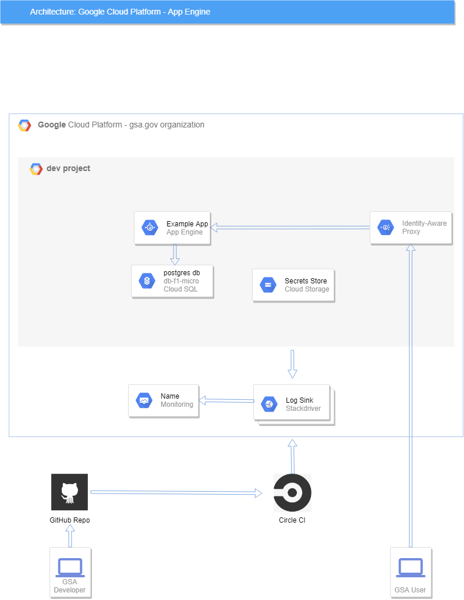

# ODP GCP App Engine Template

## Overview

This repository contains an Google Cloud App Engine project template.
The goal of this project is to provide an application team with a template to quickly 
meet their security requirements to speed them along the LATO, and eventually ATO, process.

### Diagram

## Project Contents

| Folder    |  Description    |
|---        |---              |
| .circleci   |   Directory housing the CircleCi CI code  |
| cloudsql_postgresql  |  Sample Python Flask application that we deploy to GCP App Engine to illustrate  |
| compliance  |  This dirctory contains all of the compliance documentation for this project |
| gcp_setup |  Script to configured by the Application team and deployed by the GCAP team   |
| gcp_setup_secrets     |  Production Terraform project that sets up the Stackdriver Logging for production environment.  |
| terraform     |  Terraform code that configures all of the GCP resources that are owned by the Application Team, after running gcp_setup scripts, to successfully deploy their application.  |

## Project Setup 

This template provides you with all of the components and steps required to get a example application
up and running in the GCP App Engine environment.

The provided example code is intended to run with little modification, but also be easily modified
to meet your application teams needs without sacrificing core security requirements.

* If you would like to test out how to get GCP going with some example apps, 
  then follow the [Bootstrap Process](Bootstrap.md).  This is a good place to
  start just to get your feet wet with GCP and take the example apps for a   
  test drive. 
* If you would like to begin customizing this template for your application,
  then you should consult the [Customization document](Customize.md).
* Operational procedures and workflows can be found in the 
  [Workflows documentation](Workflows.md).  This is an overview of how you
  should do development using a modified gitops system, how to find logs,
  update the infrastructure, rotate secrets, etc.

## Technologies used  

### Google App Engine
App Engine is a simple way to deploy applications that will automatically scale
up and down according to load, collect logs, etc.  https://cloud.google.com/appengine/

### Google Cloud SQL
Cloud SQL is an easy way to provision and manage databases.  We are using PostgreSQL
for our infrastructure, but you can use MySQL if you like.  Our configuration sets the
production database to be HA, with staging/dev non-HA.

### Google Stackdriver Logging

Google Stackdriver Logging provides teams with the ability to log, aggregate logs, and
export logs to external log platforms.

We employ the Stackdriver Logging Client Library for Python to illustrate how to
write logs within your application to Google Stackdriver.  https://cloud.google.com/logging/docs/reference/libraries

### Google Stackdriver Monitoring

Stackdriver Monitoring provides with the ability to monitor and report on predefined 
events and metrics or custom logging metrics.

We use Stackdriver Monitoring meeting certain CIS benchmarks, and we deploy the configuration
using Terraform.

### Terraform
Terraform orchestrates the project setup, creating databases, storage,
secrets, etc.  https://www.terraform.io/

### Circle CI
Terraform and the Google Cloud SDK are invoked on commit by Circle CI, which
automates all of the terraform, code deployment, testing and scanning tasks
for each environment.  https://circleci.com/

### OWASP ZAP
ZAP is a proxy that can be used to scan an app for common security vulnerabilities.
https://www.owasp.org/index.php/OWASP_Zed_Attack_Proxy_Project

## Example Applications

### Python / Cloud SQL Postgresql 

This application records the visitor's IP address and stores it in a Postgresql.
It also writes logs of each visit to Stackdriver Logging. 